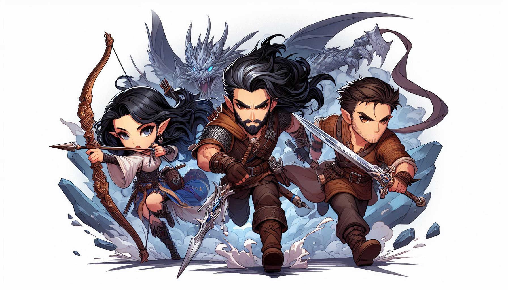

# Once Upon Agentic AI — A Developer's Epic Journey (TypeScript)



A hands-on workshop that takes you from your first AI agent to a production-style multi-agent system using the [Strands Agents TypeScript SDK](https://github.com/strands-agents/harness-sdk/tree/main/strands-ts).

> _"Roll for Initiative... in TypeScript!"_

This is a **self-contained, local-first** workshop. Everything you need lives in this repository: each chapter is a standalone `.md` file in `chapters/`, and you build the backend source code yourself as you go — there is no separate companion repository to clone. Exact end-of-chapter references live under [`completed/`](completed/) so the starter workspace does not give away the exercise. It runs entirely on your machine with a local model by default (**Ollama**); Amazon Bedrock is an **optional** cloud provider you can switch to if you prefer. After the local workshop, an optional extension deploys only the four backend agent services to AWS while the React app stays local.

---

## Workshop format

- **Build in the root `src/` directory.** A fresh clone provides only the shared `src/model.ts` model helper; each chapter tells you which files to create or replace.
- **Use `completed/<chapter>/` only as a reference.** Each snapshot shows the expected state at the end of that chapter, and `completed/final/` contains the complete backend.
- **The React client is provided.** [`web/`](web/) is the canonical maintained frontend used in Chapter 6; this workshop teaches agent integration rather than React construction.
- **Complete chapters in order.** Later services depend on the files you built earlier.

## Table of contents

| #   | Chapter                                                     | What you'll build                                             |
| :-- | :---------------------------------------------------------- | :------------------------------------------------------------ |
| 0   | [An Unexpected Adventure](chapters/00-prerequisites.md)     | Local environment: Node 22+, Ollama (default), optional Bedrock |
| 1   | [The Art of Agent Summoning](chapters/01-strands-basics.md) | Your first Strands agent                                      |
| 2   | [The Adventurer's Arsenal](chapters/02-built-in-tools.md)   | Built-in vended tools (`httpRequest`, `bash`, `fileEditor`)   |
| 3   | [Forging Custom Tools](chapters/03-custom-tools.md)         | A custom dice-rolling tool with Zod schemas                   |
| 4   | [Planar Portals: MCP](chapters/04-mcp-integration.md)       | An MCP server + client for distributed tools                  |
| 5   | [The Grand Alliance: A2A](chapters/05-a2a-integration.md)   | Three agents collaborating via Agent-to-Agent                 |
| 6   | [Web UI Testing](chapters/06-ui-testing.md)                 | Connect your local Game Master to a web UI                    |
| 7   | [Cleanup](chapters/07-cleanup.md)                           | Tidy up local processes, generated data, Ollama, and optional Bedrock |
| 8   | [Optional: Deploy the Agents to AWS](chapters/08-aws-agents-deployment.md) | Deploy the backend with AgentCore CodeZip; keep React local |
| 9   | [Optional: Real Retrieval with a Vector Store](chapters/09-rag-vector-store.md) | Swap keyword lookup for LanceDB + local embeddings (RAG) |

> Complete chapters in order — each one builds on the previous.

## Prerequisites

- **Node.js 22+** ([download](https://nodejs.org/en/download/))
- **[Ollama](https://ollama.com/download)** for the default local model (no cloud account required)
- _Optional:_ Amazon Bedrock access if you want to run against a cloud model instead
- Basic TypeScript knowledge
- A terminal

Full setup instructions: [Chapter 0](chapters/00-prerequisites.md).

## Quick start

Clone this workshop repository, install the exact locked dependencies, and pull the local model:

```bash
git clone https://github.com/salihgueler/once-upon-agentic-ai-workshop.git
cd once-upon-agentic-ai-workshop
npm ci
npm --prefix web ci
ollama pull gemma4
```

Then open [Chapter 0](chapters/00-prerequisites.md) and follow the chapters in order.

## Project layout

A fresh clone starts with the shared model helper and the provided React client. You
create the remaining backend files under `src/` while following the chapters:

```
once-upon-agentic-ai-workshop/
├── src/
│   └── model.ts              # provided model-selection helper
├── web/                      # provided canonical React frontend
├── completed/
│   ├── 01-strands-basics/    # exact end-of-chapter references
│   ├── 02-built-in-tools/
│   ├── 03-custom-tools/
│   ├── 04-mcp-integration/
│   ├── 05-a2a-integration/
│   └── final/                # complete backend reference
├── chapters/
├── knowledge/                # pre-built vector store + source PDF (Chapter 9)
├── agentcore/                # optional agents-only deployment after Chapter 5
├── package.json
└── package-lock.json
```

By the end, your root `src/` should match `completed/final/src/`. Runtime commands
always target your root `src/`; they never run the completed copies for you.

## What is Strands?

Strands is an open-source SDK (Python and TypeScript) for building AI agents and multi-agent systems. It gives you:

- **Agent creation** — single-call agent construction with system prompts and tools
- **Tool integration** — built-in vended tools, custom tools via the `tool()` factory
- **Model flexibility** — Ollama for local models, Amazon Bedrock, and other providers
- **MCP support** — talk to remote tool servers using the Model Context Protocol
- **A2A** — wrap agents as tools so they can call each other

Glossary:

| Term               | Meaning                                             |
| ------------------ | --------------------------------------------------- |
| **Agent**          | An LLM-driven worker that can reason and call tools |
| **Tool**           | A callable function the agent can invoke            |
| **System prompt**  | The instructions that shape an agent's behavior     |
| **Model provider** | Ollama (local), Bedrock, OpenAI, etc.               |
| **MCP**            | Model Context Protocol — for remote tool servers    |
| **A2A**            | Agent-to-Agent — for agents that call other agents  |

## Learning objectives

By the end:

- Build, configure, and run agents against a local model
- Use built-in tools and write your own
- Connect agents to remote services with MCP
- Orchestrate multiple cooperating agents with A2A
- Wire it all into a real application with a React web UI
- Optionally package and deploy the four backend services to AWS while keeping the UI local
- Optionally upgrade rules lookup to real semantic retrieval with a local vector store

## Reference: the talks demo repository

While building the workshop yourself, you may want a finished implementation to
compare against. [`salihgueler/code-sample-game-master`](https://github.com/salihgueler/code-sample-game-master)
is the **separate demo / reference** used in conference talks — it is **not** the
attendee source for this workshop. Treat it as a worked example to peek at if you
get stuck; the workshop chapters remain self-contained on their own.

## Resources

- [Strands documentation](https://strandsagents.com/latest/documentation/docs/)
- [Strands TypeScript SDK source (harness-sdk)](https://github.com/strands-agents/harness-sdk/tree/main/strands-ts)
- [Strands example projects](https://strandsagents.com/latest/documentation/docs/examples/)
- [Ollama](https://ollama.com/)

## License

MIT

---

[Start with Chapter 0 →](chapters/00-prerequisites.md)
