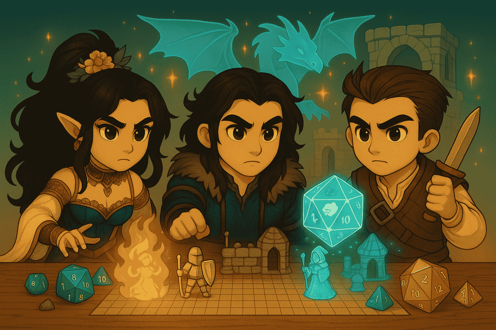

# Chapter 4 — Planar Portals: MCP Integration

[← Chapter 3](03-custom-tools.md) · [Back to README](../README.md) · [Next: Chapter 5 →](05-a2a-integration.md)

---



## Quest objective

Learn the [Model Context Protocol (MCP)](https://strandsagents.com/latest/documentation/docs/user-guide/concepts/tools/mcp-tools/) — the protocol that lets agents connect to external services and use tools that live somewhere else.

You'll build:

1. **An MCP server** at `4_mcp_integration/dice_roll_mcp_server.ts` that exposes the `roll_dice` tool
2. **An MCP client** at `4_mcp_integration/gamemaster_mcp_client.ts` that connects to the server and gives those tools to a Strands agent

```bash
cd sample-once-upon-agentic-ai-typescript
```

---

## Part 1 — The MCP server

### Step 1 — Imports

```typescript
import { McpServer } from "@modelcontextprotocol/sdk/server/mcp.js";
import { StreamableHTTPServerTransport } from "@modelcontextprotocol/sdk/server/streamableHttp.js";
import express from "express";
import z from "zod";
```

See the [MCP TypeScript SDK](https://github.com/modelcontextprotocol/typescript-sdk) for reference.

### Step 2 — Create the server

```typescript
const mcpServer = new McpServer({
  name: "D&D Dice Roll Service",
  version: "1.0.0",
});
```

### Step 3 — Register the dice tool

```typescript
mcpServer.registerTool(
  "roll_dice",
  {
    description: "Roll dice for D&D",
    inputSchema: {
      faces: z.number().default(6),
      count: z.number().default(1),
    },
  },
  async ({ faces, count }) => {
    const rolls = Array.from(
      { length: count },
      () => Math.floor(Math.random() * faces) + 1
    );
    const total = rolls.reduce((sum, roll) => sum + roll, 0);
    const result = { rolls, total, faces, count };
    return { content: [{ type: "text", text: JSON.stringify(result) }] };
  }
);
```

### Step 4 — Wire the Express transport

Each request gets its own `StreamableHTTPServerTransport`, connected to a fresh server instance:

```typescript
const app = express();
app.use(express.json());

app.post("/mcp", async (req, res) => {
  const server = createServer();
  const transport = new StreamableHTTPServerTransport({
    sessionIdGenerator: undefined,
  });
  await server.connect(transport);
  await transport.handleRequest(req, res, req.body);
  res.on("close", () => {
    transport.close();
    server.close();
  });
});

app.listen(8080, () => {
  console.log("🎲 D&D Dice Roll MCP Server running on http://localhost:8080/mcp");
});
```

---

## Part 2 — The MCP client

### Step 1 — Imports

```typescript
import { Agent, McpClient } from "@strands-agents/sdk";
import { StreamableHTTPClientTransport } from "@modelcontextprotocol/sdk/client/streamableHttp.js";
import type { Transport } from "@modelcontextprotocol/sdk/shared/transport.js";
```

### Step 2 — Connect to the server

```typescript
const mcpClient = new McpClient({
  transport: new StreamableHTTPClientTransport(
    new URL("http://localhost:8080/mcp")
  ) as Transport,
});
```

### Step 3 — List available tools

```typescript
const tools = await mcpClient.listTools();
```

### Step 4 — Pass them into an agent

```typescript
const gamemaster = new Agent({
  tools,
  systemPrompt: `You are Lady Luck, the mystical keeper of dice and fortune.`,
});

await gamemaster.invoke("Roll a d20");
```

---

## Testing the system

Run the server in one terminal:

```bash
npx tsx 4_mcp_integration/dice_roll_mcp_server.ts
```

You should see:

```
🎲 D&D Dice Roll MCP Server running on http://localhost:8080/mcp
```

In a second terminal, run the client:

```bash
npx tsx 4_mcp_integration/gamemaster_mcp_client.ts
```

Try prompts like:

- `Roll a d20`
- `Roll a d6`
- `Roll a d100`
- `Roll 4d6 for ability scores`

## Reference solutions

### `dice_roll_mcp_server.ts`

```typescript
import { McpServer } from "@modelcontextprotocol/sdk/server/mcp.js";
import { StreamableHTTPServerTransport } from "@modelcontextprotocol/sdk/server/streamableHttp.js";
import express from "express";
import z from "zod";

function createServer(): McpServer {
  const server = new McpServer({
    name: "D&D Dice Roll Service",
    version: "1.0.0",
  });

  server.registerTool(
    "roll_dice",
    {
      description: "Roll dice for D&D",
      inputSchema: {
        faces: z.number().default(6),
        count: z.number().default(1),
      },
    },
    async ({ faces, count }) => {
      const rolls = Array.from(
        { length: count },
        () => Math.floor(Math.random() * faces) + 1
      );
      const total = rolls.reduce((sum, roll) => sum + roll, 0);
      const result = { rolls, total, faces, count };
      return { content: [{ type: "text", text: JSON.stringify(result) }] };
    }
  );

  return server;
}

const app = express();
app.use(express.json());

const PORT = 8080;

app.post("/mcp", async (req, res) => {
  const server = createServer();
  const transport = new StreamableHTTPServerTransport({
    sessionIdGenerator: undefined,
  });
  await server.connect(transport);
  await transport.handleRequest(req, res, req.body);
  res.on("close", () => {
    transport.close();
    server.close();
  });
});

app.get("/mcp", async (_req, res) => {
  res.status(405).json({ error: "Method not allowed" });
});

app.delete("/mcp", async (_req, res) => {
  res.status(405).json({ error: "Method not allowed" });
});

app.listen(PORT, () => {
  console.log(
    `🎲 D&D Dice Roll MCP Server running on http://localhost:${PORT}/mcp`
  );
});
```

### `gamemaster_mcp_client.ts`

```typescript
import { StreamableHTTPClientTransport } from "@modelcontextprotocol/sdk/client/streamableHttp.js";
import { Agent, McpClient } from "@strands-agents/sdk";
import type { Transport } from "@modelcontextprotocol/sdk/shared/transport.js";
import * as readline from "readline";

async function main() {
  console.log("\nConnecting to D&D Dice Roll MCP Server...");

  const mcpClient = new McpClient({
    transport: new StreamableHTTPClientTransport(
      new URL("http://localhost:8080/mcp")
    ) as Transport,
  });

  const tools = await mcpClient.listTools();
  console.log("Available tools:", tools.map((t) => t.name));

  const gamemaster = new Agent({
    tools,
    systemPrompt: `You are Lady Luck, the mystical keeper of dice and fortune in D&D adventures.
      You speak with theatrical flair and always announce dice rolls with appropriate drama.
      You know all about D&D mechanics, always use the appropriate tools when applicable - never make up results!`,
  });

  console.log("\n🎲 Lady Luck - D&D Gamemaster with MCP Dice Rolling");

  const rl = readline.createInterface({
    input: process.stdin,
    output: process.stdout,
  });

  const askQuestion = (): void => {
    rl.question("\n🎲 Your request: ", async (userInput) => {
      if (["exit", "quit", "bye"].includes(userInput.toLowerCase())) {
        await mcpClient.disconnect();
        rl.close();
        return;
      }
      await gamemaster.invoke(userInput);
      askQuestion();
    });
  };

  askQuestion();
}

main().catch(console.error);
```

## What you learned

- How to expose tools via an MCP server with `@modelcontextprotocol/sdk`
- How a Strands agent consumes remote tools through `McpClient.listTools()`
- How streamable HTTP transports work for stateless request/response

---

[← Chapter 3](03-custom-tools.md) · [Back to README](../README.md) · [Next: Chapter 5 →](05-a2a-integration.md)
