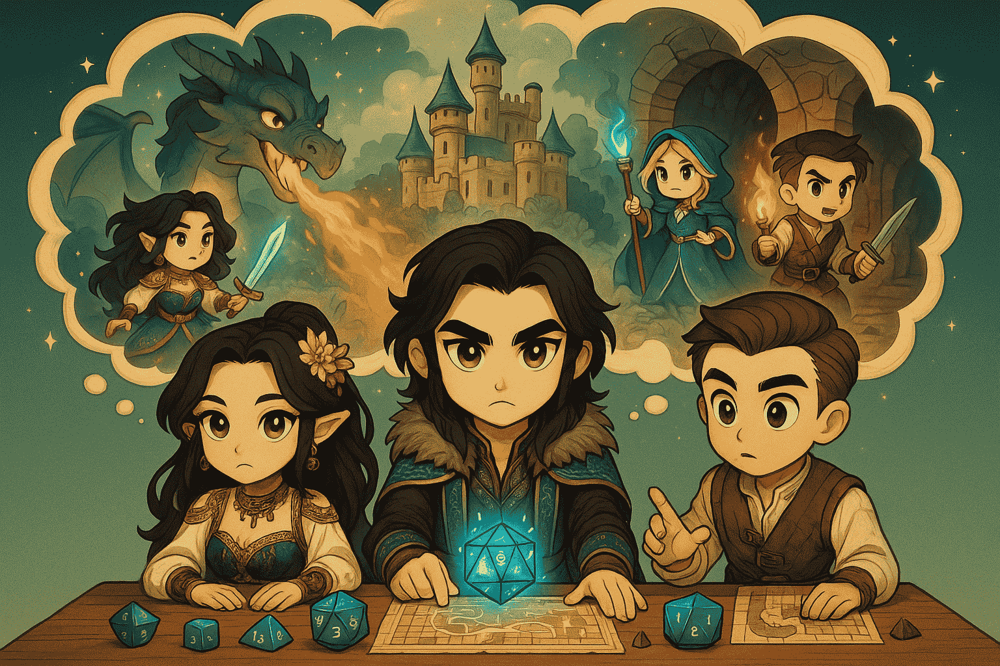

# Chapter 5 — The Grand Alliance: Agent-to-Agent

[← Chapter 4](04-mcp-integration.md) · [Back to README](../README.md) · [Next: Chapter 6 →](06-ui-testing.md)

---



## Quest objective

So far each agent has worked alone. Now you'll let multiple agents collaborate, each with its own tools and expertise, using [Agent2Agent (A2A)](https://strandsagents.com/).

You'll build a three-agent D&D system orchestrated by a central Game Master. Create each file under your root `src/`; the repository does not pre-populate these exercise implementations.

> **Create:** `src/local-rules.ts`, `src/rules-agent.ts`, `src/character-store.ts`, `src/character-agent.ts`, `src/game-master-schema.ts`, and `src/gamemaster-orchestrator.ts`<br>
> **Reference after attempting the exercise:** [`completed/05-a2a-integration/src/`](../completed/05-a2a-integration/src/)

## Architecture

```
🧙 Rules Agent      ⚔️ Character Agent     🎲 Dice MCP Server
   (port 8000)         (port 8001)           (port 8080)
        │                   │                     │
        └───────────────────┼─────────────────────┘
                            │
                  👑 Gamemaster Orchestrator
                        (port 8009)
```

| Component                   | Role                                            | File                              |
| --------------------------- | ----------------------------------------------- | --------------------------------- |
| **Rules Agent**             | D&D rules lookup from a small local dataset     | `src/rules-agent.ts`              |
| **Character Agent**         | Character creation and JSON-file storage        | `src/character-agent.ts`          |
| **Gamemaster Orchestrator** | Routes to specialists + dice MCP, narrates      | `src/gamemaster-orchestrator.ts`  |

Two things are shared across agents and worth noting up front:

- Every agent gets its model from **`createModel()`** (`src/model.ts`) — local Ollama by default, Bedrock when `MODEL_PROVIDER=bedrock`.
- The A2A protocol is served by **`A2AExpressServer`** and consumed by **`A2AAgent`**, both from the current Strands SDK.

---

## Part 1 — The Rules Agent

The Rules Agent answers mechanics questions. To keep the workshop runnable with **zero downloads or vector databases**, it looks rules up in a small local dataset.

### Step 1 — The local rules dataset (`src/local-rules.ts`)

A handful of keyword-tagged, page-referenced snippets and a tiny scorer:

```typescript
export interface Rule {
  topic: string;
  page: number;
  text: string;
  keywords: string[];
}

export const RULES: Rule[] = [
  {
    topic: "Ability Checks",
    page: 58,
    text: "Roll a d20 and add the relevant ability modifier; compare to the DC.",
    keywords: ["ability", "check", "dexterity", "strength", "dc", "d20"],
  },
  // ...saving throws, attack rolls, advantage/disadvantage, initiative,
  //    4d6-drop-lowest ability generation
];

export function lookupRule(query: string): Rule | null {
  const words = query.toLowerCase().split(/\W+/).filter(Boolean);
  let best: Rule | null = null;
  let bestScore = 0;
  for (const rule of RULES) {
    const score = rule.keywords.reduce(
      (acc, kw) => acc + (words.includes(kw) ? 1 : 0),
      0,
    );
    if (score > bestScore) {
      bestScore = score;
      best = rule;
    }
  }
  return bestScore > 0 ? best : null;
}
```

> **RAG is optional.** The Rules Agent only depends on the `lookupRule(query)` signature, not on where the data comes from. If you want real retrieval later, swap the body of `lookupRule` for a vector search (e.g. LanceDB + local embeddings) — nothing else has to change.

### Step 2 — Serve the agent over A2A (`src/rules-agent.ts`)

```typescript
import { Agent, tool } from "@strands-agents/sdk";
import { A2AExpressServer } from "@strands-agents/sdk/a2a/express";
import { z } from "zod";
import { createModel } from "./model.js";
import { lookupRule } from "./local-rules.js";

const queryDndRules = tool({
  name: "query_dnd_rules",
  description: "Fast D&D 5e rule lookup. Returns a brief rule with a page reference.",
  inputSchema: z.object({
    query: z.string().describe("The D&D rule to look up, e.g. 'dexterity check'"),
  }),
  callback: (input) => {
    const rule = lookupRule(input.query);
    if (!rule) return "No matching rule found in the Basic Rules.";
    return `${rule.topic} (p.${rule.page}): ${rule.text}`;
  },
});

const agent = new Agent({
  model: createModel(),
  tools: [queryDndRules],
  systemPrompt: `You are a D&D rules expert. Call query_dnd_rules once, then answer
    concisely, always citing the page reference the tool returns.`,
});

const server = new A2AExpressServer({
  agent,
  name: "Rules Agent",
  description: "Specialized D&D 5e rules-lookup agent with page-referenced answers.",
  port: 8000,
});

await server.serve();
console.log("🧙 Rules Agent running on http://127.0.0.1:8000");
```

`A2AExpressServer` wraps the agent in an A2A-compatible HTTP server and publishes its agent card at `/.well-known/agent-card.json`.

---

## Part 2 — The Character Agent

The Character Agent manages heroes with three tools:

- `create_character` — persists a new character (you roll its stats first)
- `find_character_by_name` — case-insensitive lookup
- `list_all_characters` — the full roster

Storage is a plain `characters.json` written next to the agent. To keep files small and each concern in one place, the storage lives in its own module.

### Step 1 — Storage (`src/character-store.ts`)

```typescript
import * as fs from "node:fs";
import * as path from "node:path";
import { fileURLToPath } from "node:url";
import { randomUUID } from "node:crypto";

const __dirname = path.dirname(fileURLToPath(import.meta.url));
const DB_PATH = path.join(__dirname, "characters.json");

export interface Stats {
  strength: number; dexterity: number; constitution: number;
  intelligence: number; wisdom: number; charisma: number;
}
export interface Character {
  character_id: string; name: string; character_class: string; race: string;
  gender: string; level: number; experience: number; stats: Stats;
  inventory: { item_name: string; quantity: number }[]; created_at: string;
}

// readDB / writeDB (JSON file), plus:
export function listCharacters(): Character[] { /* ... */ return []; }
export function findCharacter(name: string): Character | undefined { /* ... */ return undefined; }
export function saveCharacter(input: {
  name: string; character_class: string; race: string; gender: string; stats: Stats;
}): Character { /* build with level 1, starter inventory, persist, return */ return {} as Character; }
```

> The complete storage module is available at
> [`completed/05-a2a-integration/src/character-store.ts`](../completed/05-a2a-integration/src/character-store.ts)
> for comparison after you implement the structure above.

### Step 2 — The agent (`src/character-agent.ts`)

```typescript
import { Agent, tool } from "@strands-agents/sdk";
import { A2AExpressServer } from "@strands-agents/sdk/a2a/express";
import { z } from "zod";
import { createModel } from "./model.js";
import { findCharacter, listCharacters, saveCharacter } from "./character-store.js";

const statsSchema = z.object({
  strength: z.number(), dexterity: z.number(), constitution: z.number(),
  intelligence: z.number(), wisdom: z.number(), charisma: z.number(),
});

const createCharacter = tool({
  name: "create_character",
  description: "Create a character. Roll ability scores with 4d6-drop-lowest first.",
  inputSchema: z.object({
    name: z.string(),
    character_class: z.string().describe("Fighter, Wizard, etc."),
    race: z.string().describe("Human, Elf, etc."),
    gender: z.string(),
    stats: statsSchema,
  }),
  callback: (input) => JSON.stringify(saveCharacter(input)),
});

// find_character_by_name and list_all_characters follow the same shape.

const agent = new Agent({
  model: createModel(),
  tools: [/* findCharacterByName, listAllCharacters, */ createCharacter],
  systemPrompt: `You are a D&D character-management specialist. Roll ability scores with
    4d6 drop lowest, then use the tools to create, find, or list characters.`,
});

const server = new A2AExpressServer({
  agent,
  name: "Character Creator Agent",
  description: "Creates, stores, and looks up D&D characters.",
  port: 8001,
});

await server.serve();
console.log("⚔️  Character Agent running on http://127.0.0.1:8001");
```

---

## Part 3 — The Gamemaster Orchestrator

The orchestrator is itself a Strands agent that mixes **three** tool sources:

- the two specialists, reached via `A2AAgent` and wrapped as `tool()`s
- the dice MCP server from Chapter 4, passed in **directly** as an `McpClient`

It also produces **typed structured output**. Instead of asking the model for JSON and then parsing/regex-stripping it, we give the agent a Zod schema. The SDK validates the model's output against it and returns a typed object on `result.structuredOutput` — **no JSON parsing and no markdown-fence stripping**.

### Step 1 — The output schema (`src/game-master-schema.ts`)

```typescript
import { z } from "zod";

export const gameMasterSchema = z.object({
  response: z.string().describe("The narrative response, in the Game Master's voice"),
  action_suggestions: z.array(z.string()).describe("A few next actions the player could take"),
  details: z.string().describe("Brief summary of which tools or agents were used"),
  dice_rolls: z.array(z.object({
    dice_type: z.string().describe("The die used, e.g. 'd20'"),
    result: z.number().describe("The rolled total"),
    reason: z.string().describe("Why the roll was made"),
  })),
});

export type GameMasterResponse = z.infer<typeof gameMasterSchema>;
```

### Step 2 — The orchestrator (`src/gamemaster-orchestrator.ts`)

```typescript
import { Agent, McpClient, tool } from "@strands-agents/sdk";
import { A2AAgent } from "@strands-agents/sdk/a2a";
import { StreamableHTTPClientTransport } from "@modelcontextprotocol/sdk/client/streamableHttp.js";
import type { Transport } from "@modelcontextprotocol/sdk/shared/transport.js";
import express from "express";
import { z } from "zod";
import { createModel } from "./model.js";
import { gameMasterSchema, type GameMasterResponse } from "./game-master-schema.js";

const rulesAgent = new A2AAgent({ url: "http://127.0.0.1:8000" });
const characterAgent = new A2AAgent({ url: "http://127.0.0.1:8001" });

const askRulesAgent = tool({
  name: "ask_rules_agent",
  description: "Ask the Rules Agent about D&D mechanics and rules.",
  inputSchema: z.object({ question: z.string().describe("The rules question") }),
  callback: async (input) => (await rulesAgent.invoke(input.question)).toString(),
});
// askCharacterAgent follows the same shape.

const diceMcp = new McpClient({
  transport: new StreamableHTTPClientTransport(
    new URL("http://localhost:8080/mcp"),
  ) as Transport,
});

const gamemaster = new Agent({
  model: createModel(),
  tools: [askRulesAgent, /* askCharacterAgent, */ diceMcp],
  systemPrompt: `You are a D&D Game Master orchestrating specialists and tools.
    Use ask_rules_agent for rules, ask_character_agent for characters, and roll_dice
    for every roll. Populate dice_rolls and action_suggestions in your answer.`,
  structuredOutputSchema: gameMasterSchema, // ← typed, validated output
});
```

### Step 3 — A thin Express API on port 8009

```typescript
const app = express();
app.use(express.json());

app.get("/health", (_req, res) => res.json({ status: "healthy" }));

app.post("/inquire", async (req, res) => {
  const { question } = req.body as { question?: string };
  if (!question) return void res.status(400).json({ error: "Missing 'question'" });
  const result = await gamemaster.invoke(question);
  // Already typed and validated — no JSON.parse, no fence stripping.
  const structured = result.structuredOutput as GameMasterResponse | undefined;
  res.json(structured ?? { response: result.toString(), action_suggestions: [], details: "", dice_rolls: [] });
});

app.listen(8009, () => console.log("🏰 D&D Game Master API running on http://localhost:8009"));
```

---

## Running the full fellowship

You'll need **four terminals**, all from the project root. Start Ollama first (or set `MODEL_PROVIDER=bedrock`):

```bash
# Terminal 1 — Dice MCP server (from Chapter 4)
npm run mcp:server

# Terminal 2 — Rules Agent
npm run agent:rules

# Terminal 3 — Character Agent
npm run agent:characters

# Terminal 4 — Gamemaster Orchestrator
npm run game-master
```

## Try it

```bash
# Rules question
curl -X POST http://127.0.0.1:8009/inquire \
  -H "Content-Type: application/json" \
  -d '{"question": "What are the rules for dexterity checks?"}'

# Create a character
curl -X POST http://127.0.0.1:8009/inquire \
  -H "Content-Type: application/json" \
  -d '{"question": "Create a character named Thorin, a Dwarf Fighter"}'

# Roll a d20
curl -X POST http://127.0.0.1:8009/inquire \
  -H "Content-Type: application/json" \
  -d '{"question": "Roll a d20 for initiative!"}'
```

Each response is the validated `gameMasterSchema` object: a `response`, `action_suggestions`, `details`, and a `dice_rolls` array.

## What's happening under the hood

1. The orchestrator receives your question
2. It picks the right tool: `ask_rules_agent`, `ask_character_agent`, or the MCP `roll_dice`
3. The downstream agent (or MCP server) does its work and replies
4. The SDK validates the orchestrator's final answer against `gameMasterSchema` and returns it as a typed object

This is the pattern behind production multi-agent systems: a coordinator routes work to specialists and returns a strongly-typed result.

## What you learned

- How `A2AExpressServer` exposes a Strands agent over HTTP, and `A2AAgent` consumes it
- How `tool()` wraps a remote `A2AAgent` as a callable tool
- How one `Agent` can mix A2A tools and an MCP client in a single `tools` array
- How `structuredOutputSchema` gives you typed, validated output with **no JSON parsing or fence stripping**
- Why a small local dataset keeps the workshop runnable, with RAG as an optional upgrade

---

[← Chapter 4](04-mcp-integration.md) · [Back to README](../README.md) · [Next: Chapter 6 →](06-ui-testing.md)
