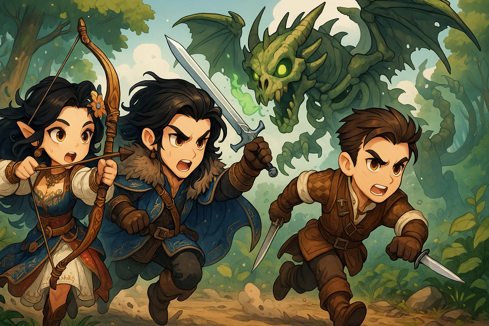
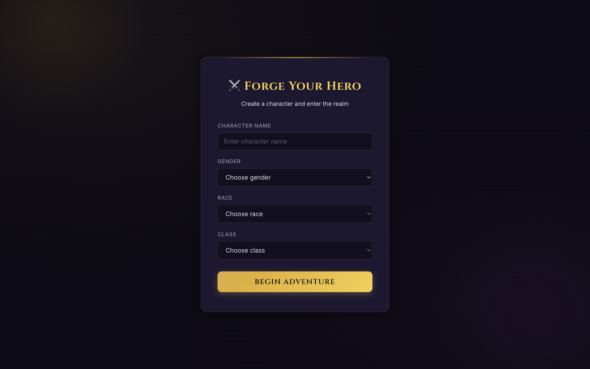
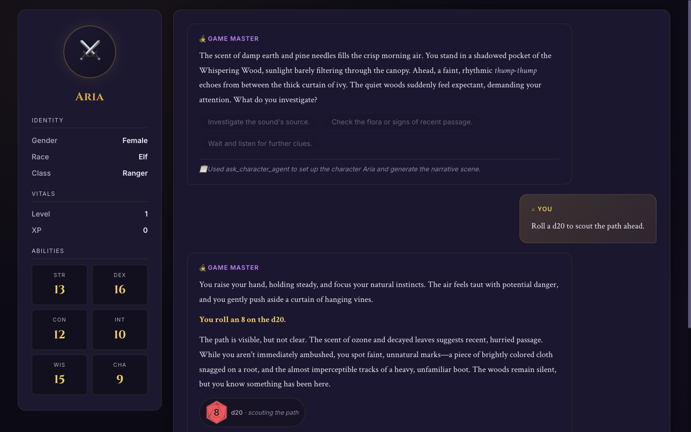

# Chapter 6 — Testing Your Game Master with the Web UI

[← Chapter 5](05-a2a-integration.md) · [Back to README](../README.md) · [Next: Chapter 7 →](07-cleanup.md)

---



## Quest objective

Play through the complete Game Master experience in the React UI shipped in [`web/`](../web): forge a character, enter the realm, choose suggested actions, and see dice results and character stats.

The workshop keeps the established gold-and-purple D&D interface used by the talks demo, cleaned up for strict TypeScript and the local structured API. You do not configure an MCP or Game Master URL in the browser.

> The [`web/`](../web) directory is the canonical workshop frontend. The separate
> `game-master-frontend` repository is a legacy snapshot with an editable server URL;
> attendees do not need to clone or run it.

## Why no server URL is needed

The browser calls same-origin `/api/*` routes on Vite. Vite forwards them to the local orchestrator on port 8009:

```text
Browser ── /api/inquire ──▶ Vite (5173) ── /inquire ──▶ Game Master (8009)
```

This avoids cross-origin configuration and keeps the attendee flow focused on the agent system.

## Step 1 — Start the fellowship

Run the four Chapter 5 processes in separate terminals:

```bash
npm run mcp:server
npm run agent:rules
npm run agent:characters
npm run game-master
```

Confirm the orchestrator is healthy:

```bash
curl http://127.0.0.1:8009/health
# {"status":"healthy"}
```

## Step 2 — Start the web UI

From the workshop root:

```bash
npm --prefix web ci
npm run web:dev
```

Open the URL Vite prints, normally <http://127.0.0.1:5173>.



## Step 3 — Play the flow

1. Forge a hero by choosing a name, gender, race, and class.
2. Select **Begin Adventure**. The orchestrator asks the Character Agent to create the hero and generates the opening scene.
3. In the game view, inspect the character sheet, send an action, or choose one of the Game Master's suggestions.



The game view shows the local character sheet, Game Master narrative, suggested actions, and MCP-backed dice results in one place.
4. When a tool rolls dice, the matching die and result appear in the narrative.

The UI consumes the validated Chapter 5 response directly:

```ts
{
  response: string;
  action_suggestions: string[];
  details: string;
  dice_rolls: Array<{ dice_type: string; result: number; reason: string }>;
}
```

Model-authored Markdown is sanitized before rendering.

## Troubleshooting

| Problem | Fix |
| :-- | :-- |
| **The opening scene fails** | Confirm all four Chapter 5 processes and Ollama are running. |
| **Vite cannot reach the API** | Check `curl http://127.0.0.1:8009/health`, then restart `npm run web:dev`. |
| **The character sheet stays empty** | Check the Character Agent terminal and confirm `src/characters.json` was created. |
| **The model is slow** | Use a smaller tool-capable Ollama model through `OLLAMA_MODEL_ID`. |

## What you learned

- How a React client consumes a typed agent response
- How Vite proxies a local multi-process backend without browser CORS configuration
- How one UI flow combines character storage, A2A delegation, MCP dice tools, and structured output

---

[← Chapter 5](05-a2a-integration.md) · [Back to README](../README.md) · [Next: Chapter 7 →](07-cleanup.md)
