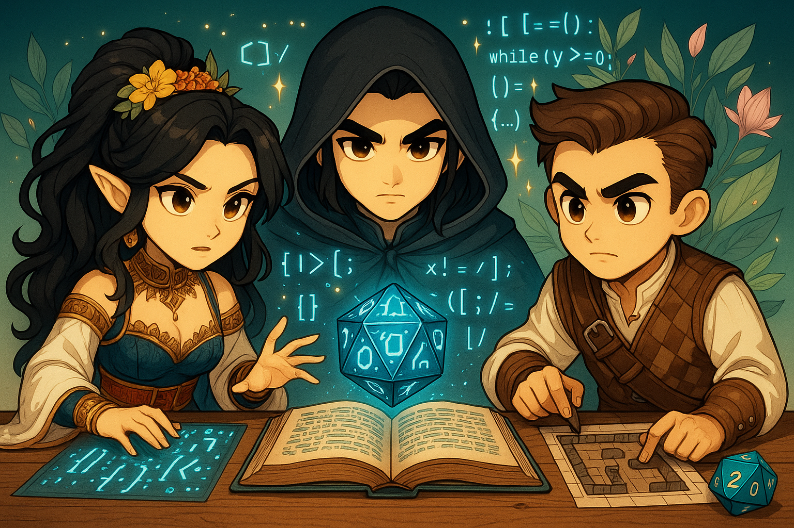

# Chapter 7 — Stretch Goals & Enhancements

[← Chapter 6](06-ui-testing.md) · [Back to README](../README.md) · [Next: Chapter 8 →](08-cleanup.md)

---



This chapter is open-ended. Pick anything that sounds fun, build it, share it.

## Visual storytelling

Add an image-generation tool so the agent can show what it's describing:

```typescript
const generateSceneImage = tool({
  name: "generate_scene_image",
  description: "Generate an image to visualize the current scene or character.",
  inputSchema: z.object({
    description: z.string().describe("Detailed description of what to visualize"),
    style: z.string().default("fantasy art").describe("Art style"),
  }),
  callback: async (input) => {
    // Call your image-gen service of choice
    return `Generated image for: ${input.description}`;
  },
});
```

Possibilities:

- Scene illustrations per location
- NPC and player-character portraits
- Battle maps
- Combat moment illustrations

## Persistent NPCs

Build a fourth agent that remembers NPCs across sessions:

- Persist NPCs to disk or a vector DB
- Track relationships per player
- Generate backstories on demand
- Load nearby NPCs based on the party's location

## Multi-player campaigns

Extend the orchestrator to:

- Track each player's character independently
- Run split-party storylines in parallel
- Award personal vs. group XP
- Manage initiative order in combat

## Dynamic world generation

```typescript
const generateLocation = tool({
  name: "generate_location",
  description: "Dynamically generate new locations based on story needs.",
  inputSchema: z.object({
    locationType: z.string().describe("dungeon, city, wilderness, etc."),
    context: z.string().describe("Current story context and player level"),
  }),
  callback: async (input) => {
    // Generate appropriate challenges and NPCs for party level
    return JSON.stringify({ location: input.locationType, details: "..." });
  },
});
```

## Mechanics tools

```typescript
const manageSpellSlots = tool({
  name: "manage_spell_slots",
  description: "Track spell slot usage and magical abilities.",
  inputSchema: z.object({
    character: z.string(),
    spellLevel: z.number(),
    action: z.string().describe("cast or recover"),
  }),
  callback: async (input) => {
    return JSON.stringify({ character: input.character, action: input.action });
  },
});

const calculateExperience = tool({
  name: "calculate_experience",
  description: "Calculate and distribute experience points fairly.",
  inputSchema: z.object({
    encounterDifficulty: z.string().describe("easy, medium, hard, or deadly"),
    partySize: z.number(),
  }),
  callback: async (input) => {
    return JSON.stringify({ xp: 100 * input.partySize });
  },
});
```

## Other ideas

- **D&D Beyond API** — pull in real character sheets
- **Voice I/O** — TTS for narration, STT for player commands
- **Discord / Slack bot** — bring the GM into your group chat
- **Cloud persistence** — store campaigns in DynamoDB or similar
- **Long-term memory** — vector DB of past sessions for callbacks
- **Style consistency** — fix one art style across all generated images

## Tips

- Start with whatever excites you most
- Build small, test often
- Keep a separate branch per experiment so you can throw away dead ends
- Share what you build

---

[← Chapter 6](06-ui-testing.md) · [Back to README](../README.md) · [Next: Chapter 8 →](08-cleanup.md)
